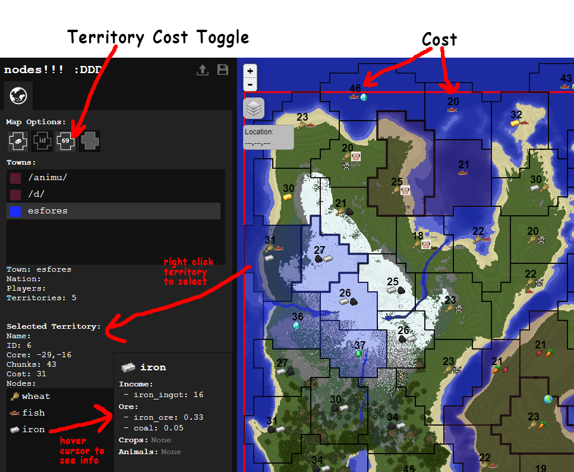

# Territories

## Overview:
- Territories have unique resources (use **/nd territory** in a region to see)
- Towns have **power** which are points they spend to claim territories
- More players in a town increases the town's power.
- Each player's power contribution to their town increases over play time (to a maximum value)
- A territory's power cost depends on its size and resources
- After making a town, claim territories using **/t claim** in the region you are standing in

## Resources
Territory resources are defined by **resource nodes**. These have four components:
- **Income**: items/blocks you get over time
- **Ore**: item drops when mining stone (gold ore, coal, ...)
- **Crops**: farm crops that can grow in a region (wheat, potatos, sugarcane, ...)
- **Animals**: animals that can breed in a region (sheep, cows, ...)

A resource node could be called "gold" for a territory with gold ore drops,
or "wheat" for a territory with wheat growth. A territory can also have a
mix of different resource nodes.

Use **/nd territory** in the region you are standing in to see its resources.
Or use the dynmap web viewer to see the map and all territories/resources.

Other notes about resources:
- By default, crops grow and animals breed only **above ground** (above a minimum y-height
and minimum sky light level ~14)
- Areas without territories or territories without towns do not have resources
(no ore drops, crop growth, or animal breeding)

## Territory Claims and Town Claim Power
Nodes uses a point system called **town power** for claiming territories. Each territory
has a different cost depending on its size and resources ([see below](./4-1-territories.md#territory-cost)).

You get an initial max claim power allowed for choosing
a territory to create your town in.

Afterwards, adding players to your town increases its max town power
to claim territories. When a player joins a town, they add a initial amount of power,
then their power contribution increases over time to a max value.

Example of this system:
1. Towns get base claim power of 30. You can create town using **/t create townname**
on any territory with cost less than or equal to 30.
2. You make your town in a territory that costs 20. Your initial town power used is 20/30.
3. Players add 5 initial power and 20 max power, with an increase of 1/hour.
4. You add one player to your town. Immediately after your town power is now 20/35.
5. Over 15 hours, your town power rises to 20/50.
6. You claim a territory with cost 25. Your town power used is now 45/50.

A player's power does not decrease after it is accumulated.
But if a player leaves its town and rejoins later, the player's
power is reset and has to accumulate again.

The dynmap viewer has an option to turn on territory cost overlays in
each territory (as shown above).

*Town power and player power ramp is intended to reward player play time and reduce
the impact of alt accounts (i.e. put alts in town, get free territories).*

## Territory Unclaim Penalty
When you unclaim a territory, your town power gets a temporary penalty
equal to the territory cost. Example:

1. Your current town claim power usage is 90/100 and you unclaim a 20 point territory
2. You receive a temporary 20 point penalty to your town power.
Your town power right after unclaiming is now 70/80.
3. If the penalty decay is 1/hour, then after 20 hours the penalty will disappear and your
claim power usage will go to 70/100.

*This is required so towns cannot rapidly claim/unclaim territories to swap resources.*

## Resource Penalty when over Claim Limits
When your town is over its claim power limit, your town will have a
resource penalty in all territories (default 50% penalty to income,
ore drops, crop growth, and breeding rates). This can occur if players
leave a town.

You will need to either get more players or reduce your town size by
unclaiming territories and waiting for the unclaim penalty to disappear.

*This penalizes groups that move players back-and-forth between
towns to claim more territory.*

## Territory Cost
Territory cost model:

**cost = base + rc + rs * a * chunks**

- **base** = base cost
- **chunks** = size of territory
- **a** = fixed scale factor per chunk (so larger territories cost more)
- **rs** = resource scale factor (e.g. shitty resource wheat rs = 1, rare resource diamond rs = 2)
- **rc** = resource constant factor

For territories with multiple resources, **rs** and **rc** are the total
from all resources: **rs = rs1 * rs2 * ...** and **rc = rc1 + rc2 + ...**.

Resource scale factors enforce that a large territory with a rare resource
is more expensive than small territory with same resource

