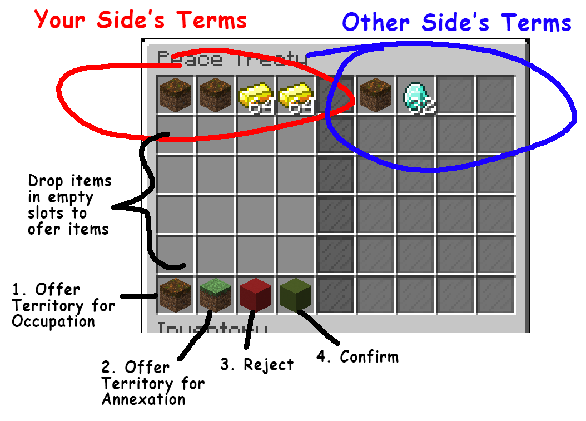

# Diplomacy and War

## War
- The server admin can turn on **war** mode.
- During war, towns can conquer or annex territories from other towns.
- Declare war on an enemy with **/war [town/nation]**.
If you or your enemy is part of a nation, all towns in the nation
will go to war together.
- Towns can end their war with a **peace treaty** (see below).
- After a peace treaty is confirmed, towns enter a **truce** period where
they cannot declare war on each other (default 48 hours)

By default, you can declare war and attack towns with no players online.
If players cannot come online for war, it's expected that the towns negotiate
a peace treaty before war weekend.

## Attacking Territories
**_TODO: include screenshot showing where players can attack from_**

Attack enemy's territory by putting down a **fence block** in a chunk (fence is a "flag")
- You must attack inwards from the edge of a territory
- Or attack from a captured chunk or ally territory
- The "flag" must see the sky (cannot place underground or underwater)
- Break the wool or fence block on a flag to stop an enemy attack
- If the flag is not broken, after some time you will capture the chunk
- Capture a territory's home chunk (**H** on territory map) to capture the whole territory

Use the Nodes minimap **/t minimap** to see what chunk you are in and where
you can attack.

## Occupation
- Each territory has a **home chunk** indicated by an "H" symbol on the map
(**/t map** or **/t minimap**).
- After capturing the home chunk, the entire territory is now **occupied** by the attacking town.
- The territory occupier gets benefits in the form of **taxes** from the
losing town.

**Taxes**: A portion of the territory's income and any ores mined, crops harvested,
or animals bred in this territory will go to the occupier.

Taxes are deposited into the occupiers **/t income** chest.

However, the occupied territory is not part of the occupier's town.
The occupier cannot build, use chests, etc... in the territory.

## Annexation

**_TODO: Conditions still being decided_**

- The town occupying a territory can choose to **annex** it.
- Annexing adds the territory into the town as a normal claimed territory.
- The annexed territory does not cost town power.

The annexed territory is same as any normal claimed territory.
The town that annexed the territory can now build, use chests, etc...

The tradeoff is you no longer get taxes from another town's labor (you will need
to work the territory yourself now).

## Peace Treaties

- Use **/peace [town/nation]** to negotiate a **peace treaty**
- This opens peace treaty GUI window
- A peace treaty can be negotiated at any time (including before war)
- After a peace treaty is accepted, the towns will enter a **truce period** (default 48 hours)
    - Towns under truce cannot declare war on each other
    - Use **/truce** to see remaining truce times with other towns

### Peace Treaty GUI (See Image Above)
- Left side are your town's current terms, right side are other party's current terms
- **Button 1** let's you give away territories to be occupied, or release occupied territories
- **Button 2** let's you give away territories to be annexed
- **Button 3** rejects the current treaty
- **Button 4** locks your side's terms. When both sides are locked, treaty
will require final confirmation from both sides.
- Drop items into empty slots to offer items as terms

You can close the treaty menu and re-open it any time (the terms will save).
Only reject the treaty if you want to delete all terms.

## Alliances
- Use **/ally [town/nation]** to offer or accept an **alliance**
- Towns or nations in an alliance cannot declare war on each other
- However, declaring war on a town/nation does not bring in allies
- Use **/unally [town/nation]** to break the alliance.
    - After the alliance is broken, the towns will enter a **truce period**

Towns can form alliances without a nation. When a town joins a nation, all
previous alliances are removed. When a town leaves a nation, its alliances
are also removed. When a nation is destroyed, all its towns alliances are removed.