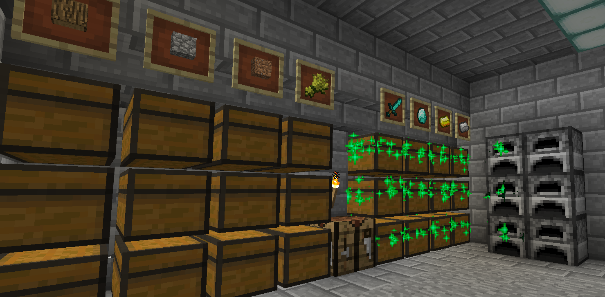

# Town Protections

- Set town permissions (for building, chests, doors, etc...) using `/t permissions [type] [group] [allow/deny]`
- There are no per-chunk, per-territory, or per-player permissions
- Protect specific chests for trusted players only using `/t protect` and clicking chests
- Use `/t trust [player]` to trust players in your town

## Permissions
Set permissions for actions in your town
(building, destroying, using doors, opening chests, etc...)
using the command below. Use just `/t permissions` to print current permissions.

`/t permissions [type] [group] [allow/deny]`

### Permissions types:
- **interact**: use blocks (doors, buttons, ...) **required for everything below**
- **build**: place blocks
- **destroy**: destroy blocks
- **chests**: open chests
- **items**: use items (CURRENTLY DOES NOTHING)
- **income**: allow opening `/t income` chest

### Permissions groups:
- **town**: players in you town
- **trusted**: trusted players in you town (using `/t trust [name]`)
- **nation**: players in your nation's towns
- **ally**: players in allied towns
- **outsider**: any player

#### Example 1: let players in your nation use chests
1. `/t permissions interact nation allow`
2. `/t permissions chests nation allow`

Due to how permissions are set up, first you have to give 
general interact permissions (allows mouse clicking, opening doors, ...).
Then you give additional permissions to use chests.

#### Example 2: let allies build/destroy (but no chest use/destruction)
1. `/t permissions interact ally allow`
2. `/t permissions build ally allow`
3. `/t permissions destroy ally allow`

Allies will not be able to open or destroy chests though.
That requires additional `chests` permission.

## Chest Protections

Towns can protect certain chests so that only leaders, officers, 
and trusted users can open them. You can use these to store reserves of valuables
that random new town residents cannot loot.

Use `/t protect` then click on chests that you want to protect.
Click on a non-chest block or type `/t protect` again to stop
selecting chests.

Containers that can be protected:
- Chests
- Trapped Chests
- Furnaces

Protected chest behaviors:
- Hoppers cannot take items out of these chests
- Untrusted players cannot open or destroy these chests
- When a protected chest is broken, its protection is removed

The town leader and officers can trust or untrust a player in the town
using `/t trust [player]` or `/t untrust [player]`. By default, new players
in the town start as untrusted.

Use `/t protect show` ingame to highlight protected chests (green sparkles are protected):

