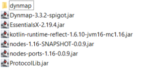
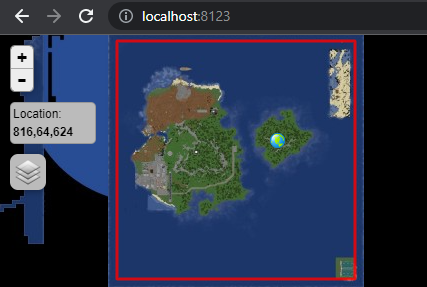
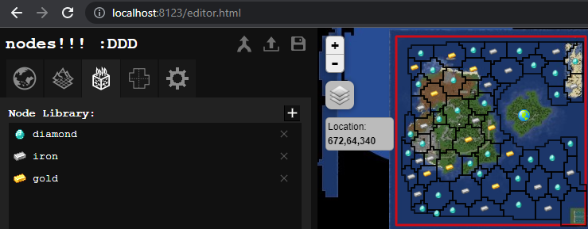

# Installation
Nodes is licensed with no warranty or support, use at your own risk, if things fuck up sorry :3

This covers installing nodes onto Minecraft server.
There is some manual file patching required, so this is more
involved than just dragging in plugins.

## Requirements

### Minecraft 1.16.5
- Paper server for 1.16.5 <https://papermc.io/api/v2/projects/paper/versions/1.16.5/builds/794/downloads/paper-1.16.5-794.jar>
- Java 16

## Plugin Requirements
- **Dynmap-3.1-beta7-spigot**: To display nodes map. Must match version listed.
- **WorldBorder**: Used to create a marker on dynmap for nodes to render (in future this requirement will be removed).
- **kotlin-runtime**: Runtime for kotlin used for nodes.
- **nodes**: Nodes.

## Installation Steps
You should receive a `.zip` containing the following:



**By installing nodes on your server you agree to the
`end_user_license_agreement.txt` (states no warranty or liability
for using plugin)**

1. Run paper server so `plugins/` folder is created.

2. Drag in `*.jar` plugins first and run server so initial
config folders are generated.

3. Do a dynmap render of the world first. Run server and type in
   server console, `dynmap fullrender [world]`, where `[world]` is your
   world name in `server.properties`.

4. WorldBorder config:  
     4.1. Go to dynmap page for server, default is typically
         <http://localhost:8123/>.  
     4.2. Check if there is already a red world border around map.
          If you already have a world border, you do not need to
          do following step, and can instead remove `WorldBorder.jar`
          if you want to just use vanilla world border.  
     4.3. If you do not have a world border, set any type of world
          border on map. Simplest is a rectangle using  
          ```
          wb [world] setcorners x0 z0 x1 z1
          ```  
          e.g. `[world]` should be `level-name=____` in `server.properties`.
          For a default world named "world", set some border like
          `wb world setcorners 0 0 1000 1000`



5. Dynmap file patching:  
     4.1. Make sure you have a dynmap rendered with a world border
          like picture above.  
     4.2. Drag the `dynmap/` folder in the .zip into `plugins/`
          so that it overwrites the built-in dynmap files
          contained in `plugins/dynmap/`.  

6. Nodes dynmap verification:  
     5.1. Keep paper server running so dynmap is running. Open a
          web browser and go to your local nodes editor at
          <http://localhost:8123/editor.html>.  
     5.2. Paint some nodes in map editor and download `world.json`
          using download button in the top-right of editor panel.  
     5.3. Put `world.json` into `plugins/nodes/world.json`  
     5.4. Restart server.  
     5.5. Reload <http://localhost:8123/editor.html> page and see
          to check if nodes are visible like below.  



7. Nodes server verification: just type `nodes` in the server
console to print nodes world info. The number of territories and
resources should match the map.

8. Configure `plugins/nodes/config.yml`

## Default New Nodes .html Pages
The dynmap patches create the following html pages:
- <http://localhost:8123/nodes.html>: This shows only the 1st tab of the
   full nodes editor (world overview).
- <http://localhost:8123/editor.html>: This provides server manager
   a local editor to paint nodes on dynmap view of the world.
   **This is all client side, no changes here affect the server.**
   Updating server world requires saving the `world.json` and placing
   it in the server `plugins/nodes/world.json` and reloading.
- <http://localhost:8123/empty.html>: Same as editor, but world is
   empty, so you can paint a fresh new map.

You can copy paste these to create new web pages as needed.
If you want to replace the default dynmap page, copy the
`nodes.html` into a new `index.html`.

## Nginx Dynmap Server (Optional)
Dynmap is notorious for being performance drag on servers.
Since nodes does not rely on dynmap for nodes rendering,
you do not actually need dynmap beyond generating the terrain
image tiles. Drawback is not having dynmap to see players
online or real-time map terrain updates. Summary of process is:

1. Use dynmap to generate terrain image tiles
2. Disable dynmap
3. Use nginx to serve dynmap image tiles and the nodes
javascript + world (rendering is all client side).
4. Turn on dynmap whenever re-rendering world is needed.

TODO

<https://github.com/webbukkit/dynmap/wiki/External-Webserver-Basics>  
<https://github.com/webbukkit/dynmap/wiki/Dynmap-with-Nginx>  