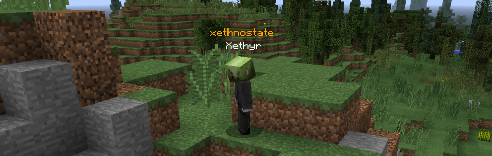

# Nametags

Nodes has a built in town nametag system (Armor Stands + teleport packet on player move). 
1. Requires ProtocolLib to be installed
2. Set `useNametags: true` in `config.yml`

Nametags only appear for players with towns. Nametag colors are customized
per viewer depending on the relationship towards the target's town:
- **green**: same town
- **orange**: neutral
- **teal**: ally
- **red**: enemy

These colors currently cannot be customized.